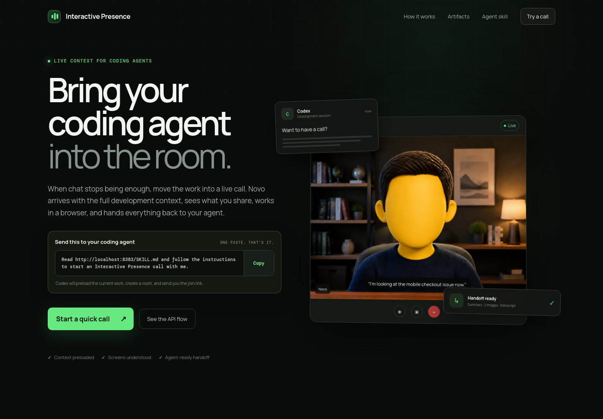
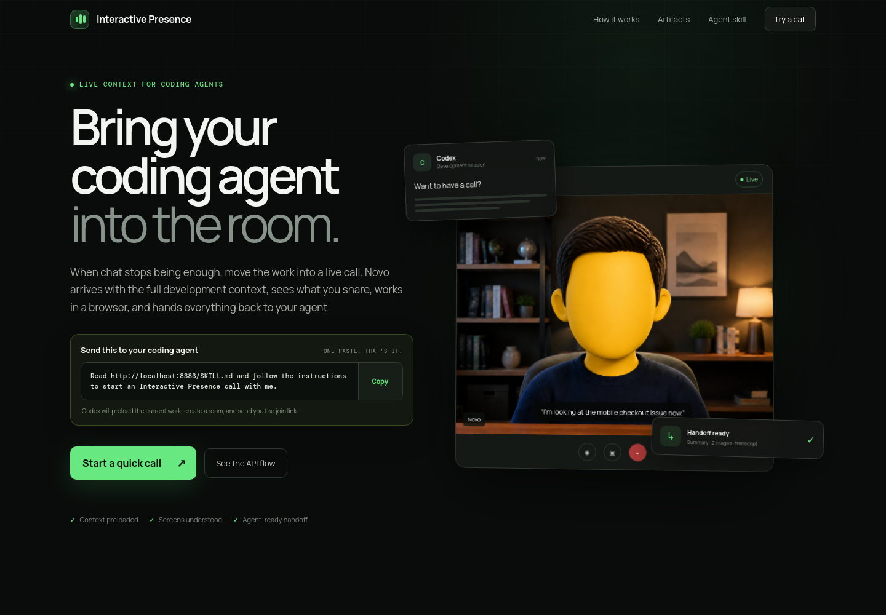

# Interactive Presence

Interactive Presence brings a coding agent into a live developer call. Novo joins with the current development context, speaks naturally, understands shared screens through a separate vision pass, can operate a Playwright browser, and returns a durable handoff when the call ends.

## Homepage





## What it does

- Creates contextual calls from a coding-agent handoff.
- Provides a Google Meet-inspired call UI with voice, captions, chat, screensharing, and an animated Novo avatar.
- Detects meaningful screenshare changes and asks a cheaper vision model for Markdown descriptions.
- Lets Novo open, browse, solve, and present pages through a Playwright browser computer.
- Captures timestamped participant and browser screenshots with a reason and visual caption.
- Stores a raw UTC transcript, event log, capture metadata, and a post-call Luna summary.
- Exposes a Codex skill at `/SKILL.md` so an agent can create and follow calls with one instruction.

## Quick start

Requirements: Node.js 20+, Docker, and an OpenAI API key.

```bash
cp .env.example .env
# Add OPENAI_API_KEY to .env
npm start
```

The server listens on `0.0.0.0:8080`:

- Homepage: <http://localhost:8080>
- Skill: <http://localhost:8080/SKILL.md>
- Call route: `/call/<uuid>`

Build the browser worker image before using Novo’s browser computer:

```bash
docker build -t firehack-browser-agent:latest ./browser-agent
```

## Agent workflow

Codex can read `/SKILL.md`, then:

1. `POST /api/calls` with a concise Markdown handoff.
2. Give the user the returned `call_url`.
3. Poll `/call/<uuid>/api` while the call is active.
4. When processing completes, retrieve `summary`, `transcript`, and `images` from the returned links.

Example:

```bash
curl -X POST http://localhost:8080/api/calls \
  -H 'Content-Type: application/json' \
  -d '{
    "title": "Checkout bug review",
    "context": "## Goal\nReproduce the mobile checkout bug.\n\n## Next action\nInspect the media query below 640px."
  }'
```

## API surface

| Endpoint | Purpose |
| --- | --- |
| `POST /api/calls` | Create a contextual call |
| `GET /call/:id/api` | Read lifecycle status and artifact links |
| `GET /call/:id/bootstrap` | Load call context for the client |
| `POST /call/:id/end` | End a call and start the handoff summary |
| `GET /call/:id/summary` | Retrieve the Luna Markdown summary |
| `GET /call/:id/transcript` | Retrieve the timestamped transcript |
| `GET /call/:id/images` | List screenshot metadata and URLs |
| `GET /call/:id/images/:capture/:file` | Serve a captured JPEG |

## Configuration

Copy `.env.example` to `.env`. `OPENAI_API_KEY` is required. `EXA_API_KEY` is optional and enables Novo’s web-search tool; never commit either value.

Call data and logs are intentionally local and ignored by Git under `runtime/` and `logs/`.

## Project layout

```text
server.js                       Realtime session, call API, captures, summaries
public/index.html                Live call UI
public/app.js                    WebRTC, captions, chat, screenshare, tools
public/home.html                 Product homepage
browser-agent/                  Playwright browser worker image
skills/interactive-presence/    Codex skill and agent metadata
runtime/meetings/                Local call artifacts (ignored)
logs/                            Local conversation logs (ignored)
```

## Security notes

This is a local hackathon demo. Keep `.env`, logs, runtime artifacts, and browser profiles private. Rotate any API key that has been exposed in chat, terminal output, or a public repository.
